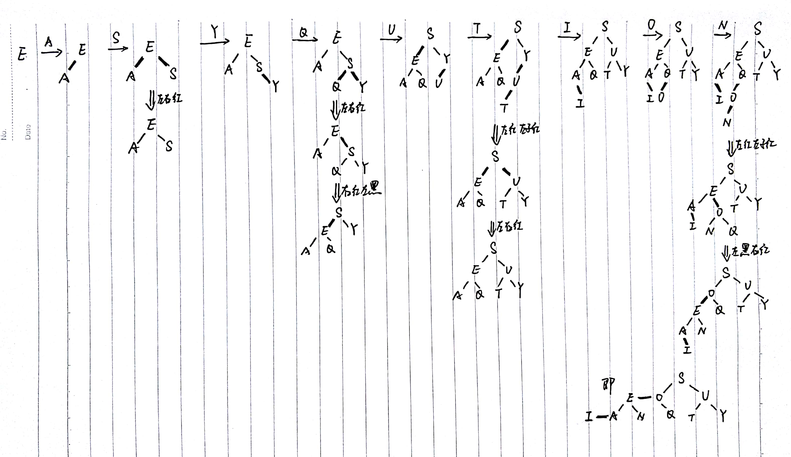

3.3.9

iii和iv是红黑二叉查找树

i和ii都不是平衡的（空链接到根节点的距离不全相同）


3.3.10 


3.3.32 AVL树

AVL树中任意结点的两个子树的高度最多差1

```java
public class AVLNode(){
  int val;
  AVLNode left, right;
  int bf;
  AVLNode(int v){
    val = v;
    left = right = null;
    bf = 0;
  }
  AVLNode(int v, int bf, AVLNode left, AVLNode right){
  	// statements
  }
}

public int bf(AVLNode node){
  if(node == null)	return 0;
  return node.bf;
}

public AVLNode insert(AVLNode node, int val){
  if(ptr == null)
    return new AVLNode(val);
  else if(val < node.val){
    node.left = insert(node.left, val);
    if(bf(node.left) - bf(node.right) == 2){
      if(val < node.left.val)	
        node = rotateLeft(node);
      else{
        node.right = rotateLeft(node.right);
        node = rotateRight(node);
      }
    }
  }else if(val > node.val){
    node.right = insert(node.right, val);
    if(bf(node.left) - bf(node.right) == -2){
      if(val > node.right.val)	
        node = rotateRight(node);
      else{
        node.left = rotateRight(node.left);
        node = rotateLeft(node);
      }
    }
  }
  node.bf = Math.max(bf(node.left), bf(node.right)) + 1;
  return node;
}

public AVLNode delete(AVLNode node, int val){
  // statements
}
```


