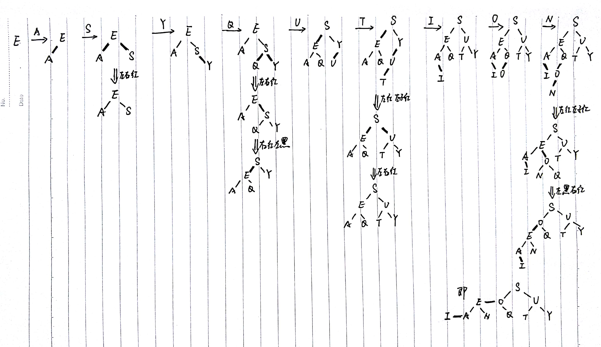

3.3.9

iii和iv是红黑二叉查找树

i和ii都不是平衡的（空链接到根节点的距离不全相同）


3.3.10 


3.3.32 AVL树

AVL树中任意结点的两个子树的高度最多差1

```java
public class AVLNode(){
  int val;
  AVLNode left, right;
  int bf;
  AVLNode(int v){
    val = v;
    left = right = null;
    bf = 0;
  }
  AVLNode(int v, int bf, AVLNode left, AVLNode right){
  	// statements
  }
}

public int bf(AVLNode node){
  if(node == null)	return 0;
  return node.bf;
}

public AVLNode insert(AVLNode node, int val){
  if(ptr == null)
    return new AVLNode(val);
  else if(val < node.val){
    node.left = insert(node.left, val);
    if(bf(node.left) - bf(node.right) == 2){
      if(val < node.left.val)	
        node = rotateLeft(node);
      else{
        node.right = rotateLeft(node.right);
        node = rotateRight(node);
      }
    }
  }else if(val > node.val){
    node.right = insert(node.right, val);
    if(bf(node.left) - bf(node.right) == -2){
      if(val > node.right.val)	
        node = rotateRight(node);
      else{
        node.left = rotateRight(node.left);
        node = rotateLeft(node);
      }
    }
  }
  node.bf = Math.max(bf(node.left), bf(node.right)) + 1;
  return node;
}

public AVLNode delete(AVLNode node, int val){
  // statements
}
```


3.3.39 删除最小键

```java
private Node moveRedLeft(Node h){
  flipColors(h);
  if(isRed(h.right.left)){
    h.right = rotateRight(h.right);
    h = rotateLeft(h);
  }
  return h;
}

public void deleteMin(){
  if(!isRed(root.left) && !isRed(root.right))
    root.color = RED;
  root = deleteMin(root);
  if(!isEmpty())
    root.color = BLACK;
}

private Node deleteMin(Node h){
  if(h.left == null)
    return null;
  if(!isRed(h.left) && !isRed(h.left.left))
    h = moveRedLeft(h);
  h.left = deleteMin(h.left);
  return balance(h);
}

private void flipColors(Node h) {
  h.color = !h.color;
  h.left.color = !h.left.color;
  h.right.color = !h.right.color;
}
```


3.3.40 删除最大键


3.3.41 **红黑树的删除**

```java
public void delete(Key key){
  if(!isRed(root.left) && !isRed(root.right))
    root.color = RED;
  root = delete(root, key);
  if(!isEmpty())
    root.color = BLACK;
}

private Node delete(Node h, Key key){
  if(key.compareTo(h.key) < 0){
    if(!isRed(h.left) && !isRed(h.left.left))
      h = moveRedLeft(h);
    h.left = delete(h.left, key);
  }else{
    if(isRed(h.left))
      h = rotateRight(h);
    if(key.compareTo(h.key) == 0 && h.right == null)
      return null;
    if(!isRed(h.right) && !isRed(h.right.left))
      h = moveRedRight(h);
    if(key.compareTo(h.key) == 0){
      h.val = get(h.right, min(h.right).key);
      h.key = min(h.right).key;
      h.right = deleteMin(h.right);
    }else
      h.right = delete(h.right, key);
  }
  return balance(h);
}

private Node balance(Node h) {
  if (isRed(h.right))                      h = rotateLeft(h);
  if (isRed(h.left) && isRed(h.left.left)) h = rotateRight(h);
  if (isRed(h.left) && isRed(h.right))     flipColors(h);

  h.size = size(h.left) + size(h.right) + 1;
  return h;
}
```

