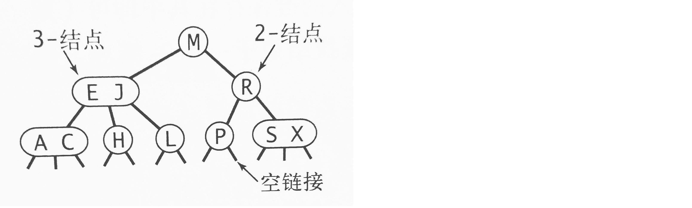
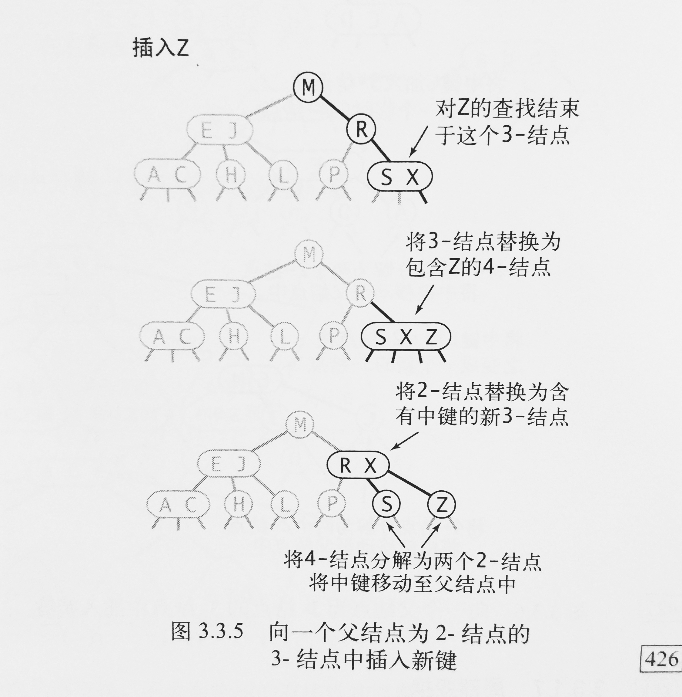
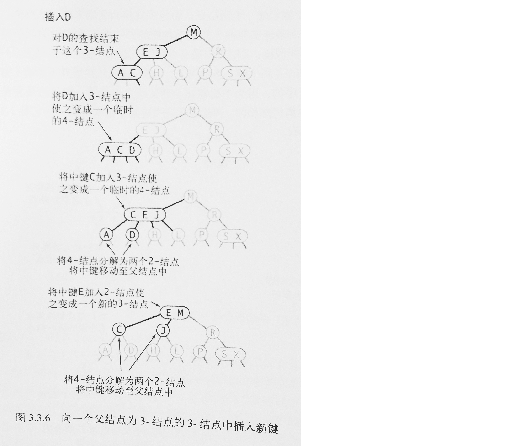
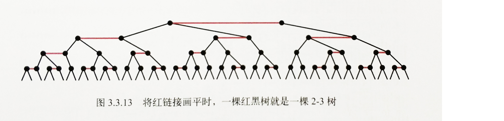
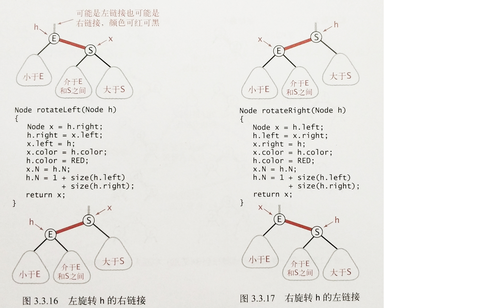

# 查找
三种经典的数据类型：二叉查找树，红黑树，散列表
## 3.1 符号表
符号表最主要的目的就是将一个键和一个值联系起来。<br>

定义：<br>
> 符号表是一种存储键值对的数据结构，支持两种操作：插入(put)和查找(get)


关于符号表的一些规则：
- 符号表的键应该是唯一的，当插入的键值对和表中已有的键冲突时，新的值会替代旧值。
- 键不能为null
- 也不能存在空值，因为当键不存在时就会返回空值。


符号表中实现删除：
- 延时删除：将键对应的值置空，然后在某个时候删去所有值为空的键。
- 即时删除：立刻从表中删除指定的键。


## 3.2 二叉查找树
定义
> 二叉查找树是一棵二叉树，其中的每个结点的键都大于其左子树中任意结点的键而小于右子树中的任意结点的键。


使用二叉查找树的算法的运行时间取决于树的形状，而树的形状又取决于键的被插入顺序。<br>
在最好的情况下，一棵含有N个结点的树是完全平衡的，每条空链接和根结点的距离都为~lgN。最坏的情况下，搜索路径可能有N个结点。<br>

在由N个随机键构造的二叉查找树中，查找命中的平均所需比较次数为~2lgN
<br>

二叉查找树中的删除/插入/查找：

```Java
public class BST<Key extends Comparable<Key>, Value> {
  private Node root;
  private class Node {
    private Key key;
    private Value val;
    private Node left, right;
    private int N;	//该子树中结点总数
    
    private Node(Key k, Value v, int N){
      // statements
    }
  }
  
  // functions
}

public Node delete(Node x, Key key){
    if(x == null)   return null;
    int cmp = key.compareTo(x.key);
    if(cmp<0)   
        x.left = delete(x.left, key);
    else if(cmp>0)
        x.right = delete(x.right, key);
    else{
        if(x.right == null)
            return x.left;
        if(x.left == null)
            return x.right;
        Node t = x.right;
        while(t.left!=null)
            t = t.left;
        x.val = t.val;
        x.right = delete(x.right, t.val);
    }
    return x;
}

public Node deleteMin(Node x){
    if(x.left == null)
        return x.right;
    x.left = deleteMin(x.left);
    return x;
}

public Node min(Node x){
    while(x.left!=null){
        x = x.left;
    }
    return x;
}

public Value get(Node x, Key key){
  if(x == null){
  	return null;
  }
  int cmp = key.comparableTo(x.key);
  if(cmp<0)	return get(x.left, key);
  eles if(cmp>0)	return get(x.right, key);
  else return x.val;
}

public void put(Node node, Key key, Value val){
  if (x==null)	return new Node(key, val, 1);
  int cmp = key.comparableTo(x.key);
  if(cmp<0)	x.left = put(x.left, key, val);
  else if(cmp>0)	x.right = put(x.right, key ,val);
  else x.val = val;
  
  x.N = size(x.left) + size(x.right) + 1;
  return x;
}
```

二叉查找树的范围查找：

```Java
private void keys(Node x, Queue<Key> queue, Key lo, Key hi){
    if(x == null)   return;
    int cmplo = lo.compareTo(x.key);
    int cmphi = hi.compareTo(x.key);
    if (cmplo < 0)  keys(x.left, queue, lo, hi);
    if (cmplo <=0 && cmphi >=0) queue.enqueue(x.key);
    if (cmphi > 0)  keys(x.right, queue, lo, hi);
}
```

## 3.3 平衡查找树
2-3查找树 定义：
> 一棵2-3查找树或为一棵空树，或由以下结点组成<br>
> - 2-结点，含有一个键或两条链接。左链接指向的2-3树中的键都小于该节点，右链接指向的2-3树中的键都大于该节点。
> - 3-结点，含有两个键和三条链接。左链接指向的2-3树中的键都小于该节点，中链接指向的2-3树中的键都在该结点的两个键之间，右链接指向的2-3树中的键都大于该节点。



指向一棵空树的链接称为空链接。

一棵完美平衡的2-3查找树中的所有空链接到根结点的距离都应该是相同的

在一棵大小为N的2-3树中，查找和插入操作访问的结点必然不超过lgN


2-3查找树中的插入

- 向2-结点中插入：把原来的2-结点变为3-结点就行

- 向一棵只有3-结点的树中插入：

  先把值插入到3-结点，使之临时变成4-结点，再把结点的中间值提出，作为父节点，而左右两个值则变成该父节点的子节点。

- 向一个父节点为2-结点的3-结点中插入：

  设父节点为A，3-结点为B，向B中插入一个值，B裂变成一个具有两个子节点的2-结点，记为C。

  再把C结点和A结点合并成新结点A‘

- 向一个父节点为3-结点的3-结点中插入：

  参加第三点，依次向上裂变合并

  


红黑二叉查找树：

基本思想：用标准的二叉查找树和一些额外信息来表示2-3树。将树中的链接分为两种：**红链接**将两个2-结点连接起来构成一个3-结点，**黑链接**则是2-3树中的普通链接。

这样，对于任意2-3树，只要对结点进行转换，都可以派生出一棵二叉查找树。这种二叉查找树称为红黑二叉查找树。


红黑树的另一种定义：含有红黑链接并满足以下条件的二叉查找树：

- 红链接均为左链接
- 没有任何一个结点和同时和两条红链接相连
- 该树是**完美黑色平衡**的，即任意链接到根结点的路径上的黑链接数量相同。




红黑树的颜色表示：

用一个boolean型变量color表示指向某结点的链接的颜色。

```java
private static final boolean RED 	= true;
private static final boolean BLACK	= false;
private class Node {
  Key key;	//键
  Value val;	//值
  Node left, right;
  int N;	//该子树中结点总数
  boolean color;
  Node(Key key, Value val, int N, boolean color){
  	// statements
  }
}
private boolean isRed(Node x) {
  if(x == null)	return false;
  return x.color == RED;
}
```


红黑树的旋转：

左旋转：将红色的右链接转化为左链接。左旋转实际上就是在两个键中，原来是将较小的键作为根结点，现在要把较大的键作为根结点，较小的键作为左子节点。

右旋转：相反。



```java
// 左旋转
Node rotateLeft (Node h) {
  Node x = h.right;
  h.right = x.left;
  x.left = h;
  x.color = h.color;
  x.N = h.N;
  h.N = 1+size(h.left)+size(h.right);
  return x;
}

// 右旋转
Node rotateRight (Node h) {
  Node x = h.left;
  h.left = x.right;
  x.right = h;
  x.color = h.color;
  x.N = h.N;
  h.N = 1+size(h.left)+size(h.right);
  return x;
}
```

<br>


**红黑二叉树的插入**

插入时默认链接是红色。

- 向单个2-结点插入新键 两种情况：

  - 新键小于老键：把新键插入在老键左边，并形成了一条红色的左链接
  - 新键大于老键：新建插入在右边，形成一个红色的右链接，此时需要rotateLeft

- 向树底部的2-结点插入新键

  用红链接将新结点和父节点相连。是否旋转情况同上

- 向一棵双键树（即一个3-结点）插入新键

  - 新键大于两个老键：此时最简单，把新键直接链接到3-结点的右侧，再把两条链接都变成黑色。此时的树就是平衡的。
  - 新键小于两个老键：新键被链接到3-结点左侧，此时产生两条连续的红链接。此时要把上层的红链接右转得到第一种情况。
  - 新键在两个老键之间：新键链接到较小老键的右侧，此时产生两条连续的红链接：一条红左，一条红右。此时需要把下层红链接左转即可得到第二种情况。（下层左转+上层右转得到第一种情况）


- 向树底部的3-结点插入新键

什么时候应该旋转？

- 如果右子节点是红色而左子节点是黑色，进行左旋转

- 如果左子节点是红色而且它的左子节点也是红色，进行右旋转

- 如果左右子节点均为红色，进行颜色转换

  颜色转换flipColors：子节点从红变黑，父节点由黑变红（根结点永远黑色）


红黑树插入算法的实现：

```java
public class RedBlackBST<Key extends Comparable<Key>, Value> {
  private Node root;
  
  private class Node;
  
  private boolean isRed(Node h);
  private Node rotateLeft(Node h);
  private Node rotateRight(Node h);
  private int size();
  
  private void flipColors(Node h){
    h.color = RED;
    h.left.color = BLACK;
    h.right.color = BLACK;
  }
  
  public void put(Key key, Value val){
    root = put(root, key, val);
    root.color = BLACK;
  }
  
  private Node put(Node h, Key key, Value val){
    if(h == null)	return new Node(key, val, 1, RED);
    int cmp = key.compareTo(h.key);
    if(cmp<0)		h.left = put(h.left, key, val);
    else if(cmp>0)	h.right = put(h.right, key, val);
    else	h.val = val;
    
    if(isRed(h.right) && !isRed(h.left))	h = rotateLeft(h);
    if(isRed(h.left) && isRed(h.left.left))	h = rotateRight(h);
    if(isRed(h.right) && isRed(h.left))		flipColors(h);
    
    h.N = size(h.left) + size(h.right) + 1;
    return h;
  }
}
```


**红黑二叉树的删除**：

删除掉一个2-结点会破坏树的完美平衡性。

删除最小键操作中的变换：在沿着左链接向下的过程中，保证以下情况之一成立

- 如果当前结点的左子结点不是2-结点，完成
- 如果当前结点的左子结点是2-结点且亲兄弟结点不是2-结点，将左子结点的兄弟结点中的一个键移动到左子结点中。
- 如果当前结点的左子结点和它的亲兄弟结点都是2-结点，将左子结点、父节点中的最小键和左子结点最近的兄弟结点合并成一个4-结点，使父节点由3-结点变2-结点或由4-结点变3-结点。


## 3.4 散列表


