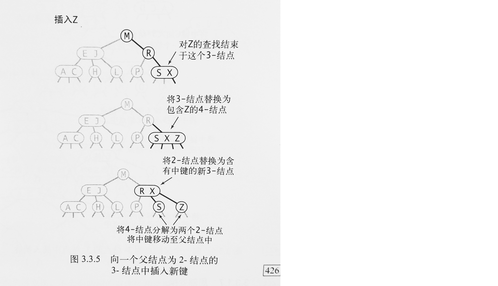

# 查找
三种经典的数据类型：二叉查找树，红黑树，散列表
## 3.1 符号表
符号表最主要的目的就是将一个键和一个值联系起来。<br>

定义：<br>
> 符号表是一种存储键值对的数据结构，支持两种操作：插入(put)和查找(get)


关于符号表的一些规则：
- 符号表的键应该是唯一的，当插入的键值对和表中已有的键冲突时，新的值会替代旧值。
- 键不能为null
- 也不能存在空值，因为当键不存在时就会返回空值。


符号表中实现删除：
- 延时删除：将键对应的值置空，然后在某个时候删去所有值为空的键。
- 即时删除：立刻从表中删除指定的键。


## 3.2 二叉查找树
定义
> 二叉查找树是一棵二叉树，其中的每个结点的键都大于其左子树中任意结点的键而小于右子树中的任意结点的键。


使用二叉查找树的算法的运行时间取决于树的形状，而树的形状又取决于键的被插入顺序。<br>
在最好的情况下，一棵含有N个结点的树是完全平衡的，每条空链接和根结点的距离都为~lgN。最坏的情况下，搜索路径可能有N个结点。<br>

在由N个随机键构造的二叉查找树中，查找命中的平均所需比较次数为~2lgN
<br>

二叉查找树中的删除：

```Java
public Node delete(Node x, Key key){
    if(x == null)   return null;
    int cmp = key.compareTo(x.key);
    if(cmp<0)   
        x.left = delete(x.left, key);
    else if(cmp>0)
        x.right = delete(x.right, key);
    else{
        if(x.right == null)
            return x.left;
        if(x.left == null)
            return x.right;
        Node t = x.right;
        while(t.left!=null)
            t = t.left;
        x.val = t.val;
        x.right = delete(x.right, t.val);
    }
    return x;
}

public Node deleteMin(Node x){
    if(x.left == null)
        return x.right;
    x.left = deleteMin(x.left);
    return x;
}

public Key min(Node x){
    while(x.left!=null){
        x = x.left;
    }
    return x.val;
}
```

二叉查找树的范围查找：

```Java
private void keys(Node x, Queue<Key> queue, Key lo, Key hi){
    if(x == null)   return;
    int cmplo = lo.compareTo(x.key);
    int cmphi = hi.compareTo(x.key);
    if (cmplo < 0)  keys(x.left, queue, lo, hi);
    if (cmplo <=0 && cmphi >=0) queue.enqueue(x.key);
    if (cmphi > 0)  keys(x.right, queue, lo, hi);
}
```

## 3.3 平衡查找树
2-3查找树 定义：
> 一棵2-3查找树或为一棵空树，或由以下结点组成<br>
> - 2-结点，含有一个键或两条链接。左链接指向的2-3树中的键都小于该节点，右链接指向的2-3树中的键都大于该节点。
> - 3-结点，含有两个键和三条链接。左链接指向的2-3树中的键都小于该节点，中链接指向的2-3树中的键都在该结点的两个键之间，右链接指向的2-3树中的键都大于该节点。


指向一棵空树的链接称为空链接。

一棵完美平衡的2-3查找树中的所有空链接到根结点的距离都应该是相同的

在一棵大小为N的2-3树中，查找和插入操作访问的结点必然不超过lgN个

2-3查找树中的插入

- 向2-结点中插入：把原来的2-结点变为3-结点就行

- 向一棵只有3-结点的树中插入：

  先把值插入到3-结点，使之临时变成4-结点，再把结点的中间值提出，作为父节点，而左右两个值则变成该父节点的子节点。

- 向一个父节点为2-结点的3-结点中插入：

  设父节点为A，3-结点为B，向B中插入一个值，B裂变成一个具有两个子节点的2-结点，记为C。

  再把C结点和A结点合并成新结点A‘

- ​

- 