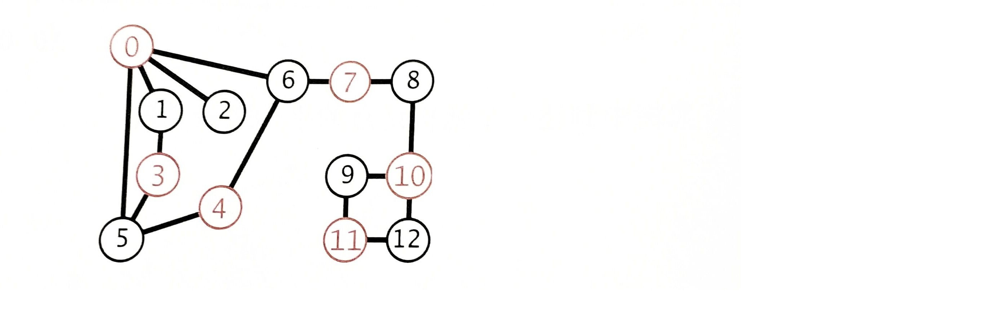
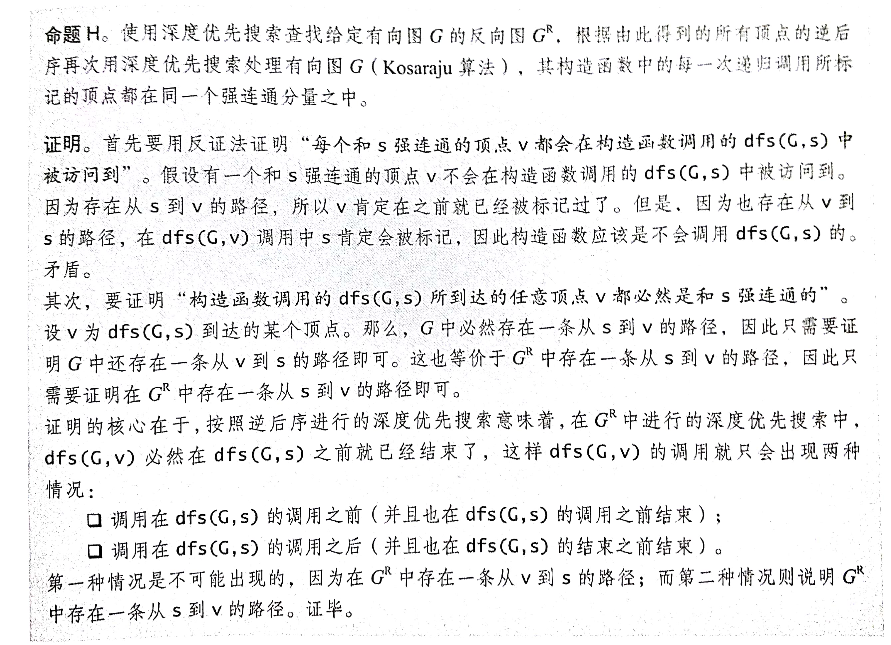

## 无向图

> 图是由一组顶点和一组能够将两个顶点相连的变组成的。

```
用0到v-1的整数来表示含V个顶点的图中的各个顶点
v-w的记法来表示v和w之间的边。在无向图中，v-w和w-v是相同的。
```

两种特殊的图：

- 自环：一条连接一个顶点和其自身的边
- 平行边：连接同一对顶点的两条边


当两个顶点通过一条边相连时，我们称这两个顶点是***相邻的***，并称这条边依附于这两个顶点。

**路径**是由边顺序连接的一系列顶点。

简单路径是一条没有重复顶点的路径。

环是一条至少含有一条边且起点和终点相同的路径。

> 如果从任意一个顶点都存在一条路径到达另一个任意顶点，我们称这幅图是**连通图**。
>
> 一幅非连通的图由若干连通的部分组成，它们都是其极大连通子图。


> 树是一幅无环连通图
>
> 互不相连的树组成的集合称为森林。


当且仅当一副含有V个结点的图G满足以下5个条件之一时，它就是一棵树：

- G有V-1条边且不含有环
- G有V-1条边且是连通的
- G是连通的，但删除任意一条边都会使它不连通
- G是无环的，但添加任意一条边都会产生一条环
- G中的任意一对顶点之间仅存在一条简单路径


二分图：一种能够将所有结点都分为两部分的图。其中图的每条边所连接的两个顶点都分别属于不同的部分。

常用的图处理代码

```java
public int V();	//顶点数
public int E();	//边数
public addEdge(int v, int w);	//添加一条边v-w
public Interable<Integer> adj(int v);	// 和v相邻的所有顶点
public String toString();

public static int degree(Graph G, int v){
  int degree = 0;
  for(int w : G.adj(v))	degree++;
  return degree;
}

public static int maxDegree(Graph G){
  int max = 0;
  for(int v = 0; v < G.V(); v++)
    if(degree(G, v) > max)
      max = degreee(G, v);
  return max;
}

public static double avgDegree(Graph G){
  return 2.0 * G.E() / G.V();
}

// 图中自环的数量
public static int numberOfSelfLoops(Graph G){
  int count = 0;
  for(int v = 0; v < G.V(); v++)
    for(int w : G.adj(v))
      if(v == w)	count++;
  return count / 2;
}
```


### 图的表示方法：邻接表

将每个顶点的所有相邻结点都保存在该顶点对应的元素所指向的一张链表中。

这个链表可以用Bag来实现（链表中所有点与点之间并没有联系）

```java
import edu.princeton.cs.algs4.Bag;
import edu.princeton.cs.algs4.In;

import java.util.Iterator;

public class Graph {
    private final int V;
    private int E;
    private Bag<Integer>[] adj;

    public Graph(int V) {
        this.V = V;	//读取V并将图初始化
        this.E = 0;
        adj = (Bag<Integer>[]) new Bag[V];
        for (int v = 0; v < V; v++)
            adj[v] = new Bag<Integer>();
    }

    public Graph(In in) {
        this(in.readInt());
        int E = in.readInt();
        for (int i = 0; i < E; i++) {
            int v = in.readInt();
            int w = in.readInt();
            addEdge(v, w);
        }
    }

    public int V() {
        return V;
    }

    public int E() {
        return E;
    }

    public void addEdge(int v, int w) {
        adj[v].add(w);
        adj[w].add(v);
        E++;
    }

    public Iterable<Integer> adj(int v) {
        return adj[v];
    }

    public String toString() {
        String s = V + " vertices, " + E + " edges\n";
        for (int v = 0; v < V; v++) {
            s += v + ": ";
            for (int w : this.adj(v))
                s += w + " ";
            s += "\n";
        }
        return s;
    }
}
```


### 深度优先搜索	DFS

```java
public class DepthFirstSearch {
  private boolean[] marked;
  private int count;
  
  public DepthFirstSearch(Graph G, int s){
    marked = new boolean[G.V()];
    dfs(G, s)
  }
  
  private void dfs(Graph G, int v){
  	marked[v] = true;
    count++;
    for(int w: G.adj(v))
      if(!marked[w])	dfs(G, w);
  }
}
```

使用深度优先搜索得到的从给定起点到任意标记顶点的路径所需时间与路径的长度成正比。


### 广度优先搜索	BFS

实现思路：使用一个**<u>队列</u>**来保存所有已经被标记过的但其领接表还未被检查的顶点。重复以下步骤:

- 取队列中的下一个顶点v并标记它。
- 将与v相邻的所有未被标记过的顶点加入到队列。

```java
private void bfs(Graph G, int s){
  Queue<Integer> queue = new Queue<Integer>();
  marked[s] = true;
  queue.enqueue(s);
  while(!queue.isEmpty()){
  	int v = queue.dequeue();
    for(int w : G.adj(v))
      if(!marked[w]){
        marked[w] = true;
        queue.enqueue(w);
      }
  }
}
```

对于从s可达的任意顶点v，广度优先搜索都能找到一条从s到v的最短路径。

广度优先搜索所需时间在最坏情况下和V+E成正比。


### 连通分量

使用深度优先搜索来找出图中所有的连通分量：

```java
public class CC{
  private boolean[] marked;
  private int[] id;
  private int count;
  public CC(Graph G){
    marked = new boolean[G.V()];
    id = new int[G.V()];
    for(int s = 0; s<G.V(); s++){
      if(!marked[s]){
        dfs(G, s);
        count++;
      }
    }
  }
  
  private void dfs(Graph G, int v){
    marked[v] = true;
    id[v] = count;
    for(int w: G.adj(v))
      if(!marked[w])
        dfs(G, w);
  }
  
  public int id(int v){
    return id[v];
  }
  
  public int count(){
    return count;
  }
}
```

深度优先搜索处理其他问题的事例：

双色问题（能否用两种颜色将图中所有顶点着色，即判断是否是二分图）：

```java
private void dfs(Graph G, int v){
  marked[v] = true;
  for(int w: G.adj(v))
    if(!marked[w]){
      color[w] = !color[v];
      dfs(G, w);
    }
  	else if(color[w] == color[v])	isTwoColorable = false;
}
```

**判断无环图**（假设不存在自环或平行边）

```java
public void dfs(Graph G, int v, int u){
  marked[v] = true;
  for(int w: G.adj(v))
    if(!marked[w])
      dfs(G, w, v);
  	else if(w != u)	hasCycle = true;
}
```


<br>

在一幅连通图中，如果一条边被删除后图被分为两个独立的连通分量，这条边就被称为**桥**。

没有桥的图称为边连通图。


## 有向图

> 一幅有方向性的图（有向图）是由一组顶点和一组有方向的边组成的，每条有方向的边都连接着有序的一对顶点。

我们称一条有向边由第一个顶点**指出**并**指向**第二个顶点。

出度：某顶点指出的边的总数

入度：指向某顶点的边的总数

用v -> w表示一条由v指向w的边。v是边的头，w是边的尾。

有向图的代码实现：

```java
import edu.princeton.cs.algs4.Bag;
public class Digraph {
    private final int V;
    private int E;
    private Bag<Integer>[] adj;

    public Digraph(int V) {
        this.V = V;
        this.E = 0;
        adj = (Bag<Integer>[]) new Bag[V];
        for (int v = 0; v < V; v++)
            adj[v] = new Bag<Integer>();
    }

    public void addEdge(int v, int w) {
        adj[v].add(w);
        E++;
    }

    public Iterable<Integer> adj(int v) {
        return adj[v];
    }
  
	/**
     * 返回该图的一个反向副本。通过这个方法可以找到指向每个顶点的所有边
     *
     * @return Digraph
     */
    public Digraph reverse() {
        Digraph R = new Digraph(V);
        for (int v = 0; v < V; v++)
            for (int w : adj(v))
                R.addEdge(w, v);
        return R;
    }
}
```


> 有向无环图就是一幅不含有向环的有向图。


### 寻找有向环

```java
import edu.princeton.cs.algs4.Stack;

public class DirectedCycle {
    private boolean[] marked;
    private int[] edgeTo;
    private Stack<Integer> cycle;   // 有向环中的所有顶点
    private boolean[] onStack;  // 递归调用的栈上的所有顶点

    public DirectedCycle(Digraph G) {
        onStack = new boolean[G.V()];
        edgeTo = new int[G.V()];
        marked = new boolean[G.V()];
        for (int v = 0; v < G.V(); v++)
            if (!marked[v])
                dfs(G, v);
    }

    private void dfs(Digraph G, int v) {
        onStack[v] = true;
        marked[v] = true;
        for (int w : G.adj(v)) {
            if (this.hasCycle()) return;
            else if (!marked[w]) {
                edgeTo[w] = v;
                dfs(G, w);
            } else if (onStack[w]) {
                cycle = new Stack<>();
                for (int x = v; x != w; x = edgeTo[x]) {
                    cycle.push(x);
                }
                cycle.push(w);
                cycle.push(v);
            }
        }
        onStack[v] = false;
    }

    public boolean hasCycle() {
        return cycle != null;
    }

    public Iterable<Integer> cycle() {
        return cycle;
    }
}
```

<br>

**拓扑排序**：给定一幅有向图，将所有顶点排序，使得所有的有向边均从排在前面的元素指向排在后面的元素。

一般来说，如果一个有优先级限制的问题中存在有向环，这个问题肯定是无解的。

### 拓扑排序

先判断是否存在有向环（有向环的检测是排序的前提），再调用基于深度优先搜索的逆后序排序方法

```java
public class Topological {
    private Iterable<Integer> order;

    public Topological(Digraph G) {
        DirectedCycle cyclefinder = new DirectedCycle(G);
        if (!cyclefinder.hasCycle()) {
            DepthFirstOrder dfs = new DepthFirstOrder(G);
            order = dfs.reversePost();
        }
    }

    public boolean isDAG() {
        return order != null;
    }

    public Iterable<Integer> order() {
        return order;
    }
}
```

<br>

### 强连通性

> 如果两个顶点v和w是互相可达的，则称它们是强连通的。
>
> 如果一幅有向图中的任意两个顶点都是强连通的，则称这幅有向图也是强连通的。

两个顶点是强连通的当且仅当它们都在一个普通的有向环中。

任何顶点和自己都是强连通的（自反性）

一个强连通图中只含有一个强连通分量，而一个有向无环图中则含有V个强连通分量。

<br>


计算强连通分量：**Kosaraju算法**

- 在有向图G中，计算它的反向图(Digraph.reverse)的逆后序排列(DepthFirstOrder.reversePost)
- 在G中进行标注的深度优先搜索，但是要按照刚才得到的顶点顺序来访问所有未被标记的顶点
- 所有在同一个dfs()调用中被访问到的顶点都在同一个强连通分量中。

对算法正确性的证明：



代码：

```java
public class KosarajuCC {
    private boolean[] marked;
    private int[] id;   //强连通分量的标识符
    private int count;

    public KosarajuCC(Digraph G) {
        marked = new boolean[G.V()];
        id = new int[G.V()];
        DepthFirstOrder order = new DepthFirstOrder(G.reverse());
        for (int s : order.reversePost()) {
            if (!marked[s]) {
                dfs(G, s);
                count++;
            }
        }
    }

    public boolean stronglyConnected(int v, int w) {
        return id[v] == id[w];
    }

    private void dfs(Digraph G, int v) {
        marked[v] = true;
        id[v] = count;
        for (int w : G.adj(v))
            if (!marked[w])
                dfs(G, w);
    }

    public int id(int v) {
        return id[v];
    }

    public int count() {
        return count;
    }
}
```


### 可达性

闭包：

> 有向图G的传递闭包是由相同的一组顶点组成的另一幅有向图，在传递闭包中存在一条从v指向w的边当且仅当在G中w是从v可达的。

<br>

## 最小生成树

> 图的生成树是它的一棵含有其所有顶点的无环连通子图。一幅加权图的最小生成树(MST)是它的一棵权值最小的生成树。

最下生成树只可能出现在连通图中。

边的权重可以是0或负数。且所有边的权重都各不相同（如果不同边的权重可以相同，最小生成树就不一定唯一了）

切分定理：

> 在一幅加权图中，给定任意的切分，它的横切边中的权重最小者必然属于图的最小生成树

贪心算法求最小生成树：

初始状态下所有边均为灰色，找到一种切分，它产生的横切边均不为黑色。将它权重最小的横切边标记为黑色。如此反复，知道标记了V-1条黑色边为止。

<br>

带权重的边的数据模型:

```java
public class Edge implements Comparable<Edge> {
    private final int v;
    private final int w;
    private final double weight;

    public Edge(int v, int w, double weight) {
        this.v = v;
        this.w = w;
        this.weight = weight;
    }

    public double weight() {
        return weight;
    }

    public int either() {
        return v;
    }

    public int other(int vertex) {
        if (vertex == v) return w;
        else if (vertex == w) return v;
        else throw new RuntimeException("Inconsistent edge");
    }

    public int compareTo(Edge that) {
        if (this.weight() < that.weight()) return -1;
        else if (this.weight() > that.weight()) return 1;
        return 0;
    }
}
```

<br>


### Prim算法

Prim算法的延时实现

```java
import edu.princeton.cs.algs4.*;

public class LazyPrimMST {
    private boolean[] marked;
    private Queue<Edge> mst;
    private MinPQ<Edge> pq;

    private LazyPrimMST(EdgeWeightedGraph G) {
        pq = new MinPQ<>();
        marked = new boolean[G.V()];
        mst = new Queue<>();

        visit(G, 0);
        while (!pq.isEmpty()) {
            Edge e = pq.delMin();
            int v = e.either(), w = e.other(v);
            if (marked[v] && marked[w]) continue;
            mst.enqueue(e);
            if (!marked[v]) visit(G, v);
            if (!marked[w]) visit(G, w);
        }
    }

    public Iterable<Edge> edges(){
        return mst;
    }
  
    private void visit(EdgeWeightedGraph G, int v) {
        marked[v] = true;
        for (Edge e : G.adj(v))
            if (!marked[e.other(v)]) pq.insert(e);
    }
}
```

<br>

Prim算法的即时实现

对LazyPrimMST的改进：对于非树节点w，不需要在优先队列中保存所有从w到树顶点的边，而只要保留其中权重最小的那条边。而每次将节点v添加到树中时，只要检查是否需要更新这条边即可。

Prim类的实现中有如下性质：

- 如果顶点v不在树中但至少含有一条边可以将v和树相连，那么edgeTo[v]就是将v和树相连的最短边，distTo[v]就是这条边的权重
- 所有这类顶点v都保留在一条索引优先队列中。索引v关联的值是edgeTo[v]的边的权重。


```java
import edu.princeton.cs.algs4.*;

public class PrimMST {
    private Edge[] edgeTo;  // 距离树最近的边
    private double[] distTo;	// distTo[w]=edgeTo[w].weight()
    private boolean[] marked;
    private IndexMinPQ<Double> pq;

    public PrimMST(EdgeWeightedGraph G) {
        edgeTo = new Edge[G.V()];
        distTo = new double[G.V()];
        marked = new boolean[G.V()];
        for (int v = 0; v < G.V(); v++)
            distTo[v] = Double.POSITIVE_INFINITY;	//distTo[v]的默认值是正无穷，即如果点v和树中间没有直接的边可连接，则distTo[v]以无穷来标记
        pq = new IndexMinPQ<>(G.V());
        distTo[0] = 0;
        pq.insert(0, 0.0);
        while (!pq.isEmpty()) {
            visit(G, pq.delMin());
        }
    }

    private void visit(EdgeWeightedGraph G, int v) {
        marked[v] = true;
        for (Edge e : G.adj(v)) {
            int w = e.other(v);
            if (marked[w]) continue;
            if (e.weight() < distTo[w]) {
                edgeTo[w] = e;
                distTo[w] = e.weight();
                if (pq.contains(w)) pq.change(w, distTo[w]);
                else pq.insert(w, distTo[w]);
            }
        }
    }

    public Iterable<Edge> edges() {
        Bag<Edge> mst = new Bag<>();
        for (int v = 1; v < edgeTo.length; v++)
            mst.add(edgeTo[v]);
        return mst;
    }
}
```

<br>

Kruskal算法

按照边的权重顺序来处理它们，加入的边不会和已加入的构成环，直到树中含有$V-1$边为止

实现算法：使用优先队列来将边按权重顺序排序，使用union-find来判断是否会构成环，使用一条队列来保存生成树的所有边。

```java
import edu.princeton.cs.algs4.*;

public class KruskalMST {
    private Queue<Edge> mst;

    public KruskalMST(EdgeWeightedGraph G) {
        mst = new Queue<>();
        MinPQ<Edge> pq = new MinPQ<>();
        for (Edge e : G.edges()) pq.insert(e);

        UF uf = new UF(G.V());
        while (!pq.isEmpty() && mst.size() < G.V() - 1) {
            Edge e = pq.delMin();
            int v = e.either(), w = e.other(v);
            if (uf.connected(v, w)) continue;	//判断v和w是否是已连接状态
            uf.union(v, w);
            mst.enqueue(e);
        }
    }

    public Iterable<Edge> edges() {
        return mst;
    }
}
```

<br>

## 最短路径

