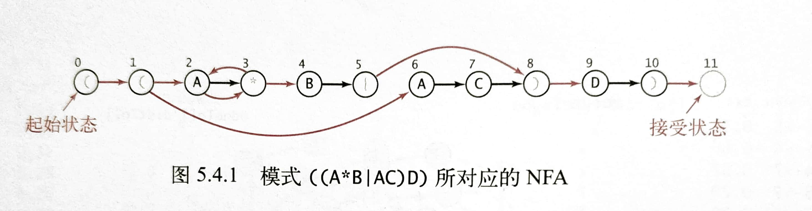

## 5.4 正则表达式

基本操作：

- 连接：AB
- 或：A|B
- 闭包：A*

<br>

正则表达式的定义：

>  一个正则表达式可以是：
>
> - 空字符串ε
> - 单个字符
> - 包含在括号中的另一个正则表达式
> - 两个或多个连接起来的正则表达式
> - 由或运算分隔的两个或多个正则表达式
> - 由闭包运算标记的一个正则表达式

<br>

字符集描述符：

| 名称   | 记法   | 举例           |
| ---- | ---- | ------------ |
| 通配符  | .    |              |
| 指定集合 | []   | [abcd]*      |
| 范围集合 | [-]  | [a-zA-Z0-9]* |
| 补集   | ^[]  | ^[abc]*      |

<br>

闭包简写

| 选项         | 记法      | 举例        | 原始写法             |
| ---------- | ------- | --------- | ---------------- |
| 至少重复一次     | +       | A+        | AA*              |
| 重复0次或1次    | ?       | A?        | ε\|A             |
| 重复指定次数     | {数字}    | (AB){3}   | (AB)(AB)(AB)     |
| 重复指定范围内的次数 | {数字-数字} | (AB){1-2} | (AB) \| (AB)(AB) |

<br>

转义

对于特殊字符，需要前面加转义符\\才能正确表现出来。


### NFA

非确定有限状态自动机

定义的DFA有以下特点：

- 长度为M的正则表达式中每个字符在NFA中有且只有一个对应的状态。NFA起始状态为0并还有一个虚拟的接受状态M
- 字母表中的字符所对应的状态都有一条从它指出的边，这条边指向模式中的下一个字符对应的状态（黑边）
- 元字符所对应的状态至少含有一条指出的边（红边），这些边可能指向其他的任意状态。
- 一个状态只能有一条指出的黑边。



NFA和正则匹配：

```java
import edu.princeton.cs.algs4.*;
import java.util.Scanner;

public class NFA {
    private char[] re;
    private Digraph G;
    private int M;

    public NFA(String regexp) {
        Stack<Integer> ops = new Stack<>();
        re = regexp.toCharArray();
        M = re.length;
        G = new Digraph(M + 1);

        for (int i = 0; i < M; i++) {
            int lp = i;
            if (re[i] == '(' || re[i] == '|') {
                ops.push(i);
            } else if (re[i] == ')') {
                int or = ops.pop();
                if (re[or] == '|') {
                    lp = ops.pop();
                    G.addEdge(lp, or + 1);
                    G.addEdge(or, i);
                } else lp = or;
            }
            if (i < M - 1 && re[i + 1] == '*') {
                G.addEdge(lp, i + 1);
                G.addEdge(i + 1, lp);
            }
            if (re[i] == '(' || re[i] == '*' || re[i] == ')')
                G.addEdge(i, i + 1);
        }
    }

    public boolean recognizes(String txt) {
        Bag<Integer> pc = new Bag<>();
        DirectedDFS dfs = new DirectedDFS(G, 0);
        for (int v = 0; v < G.V(); v++)
            if (dfs.marked(v)) pc.add(v);
        for (int i = 0; i < txt.length(); i++) {
            Bag<Integer> match = new Bag<>();
            for (int v : pc)
                if (v < M)
                    if (re[v] == txt.charAt(i) || re[v] == '.')
                        match.add(v + 1);
            pc = new Bag<>();
            dfs = new DirectedDFS(G, match);
            for (int v = 0; v < G.V(); v++)
                if (dfs.marked(v))
                    pc.add(v);
        }
        for (int v : pc)
            if (v == M) return true;
        return false;
    }
}
```

<br>

## 5.5 数据压缩

