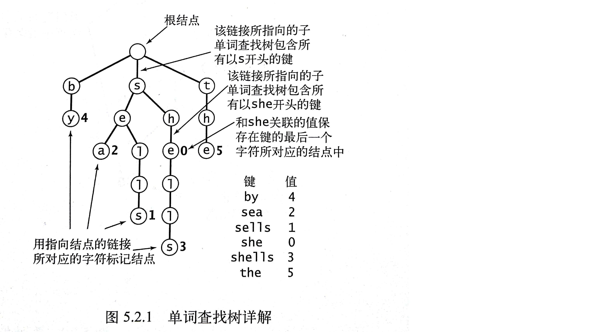

## 字符串排序

低位优先（LSD）：从右向左检查键中的字符。如果把一个字符串看做是一个256进制的数字，那么从右向左检查就等价于先检查数字的地位。<br> LSD适合用于键的**长度都相同**的字符串的排序应用。

高位优先（MSD）：从左向右检查字符。

### 键索引计数法

根据键索引的值进行排序，适用情景如：通过班级号对学生排序。

键索引计数法适用于小整数键的排序。键索引计数法排序有个特点：**原来有序的元素将保持相对有序**。

代码分析：

- 首先要计算每个键出现的频率，count[r+1]代表r索引出现的频率。

  为什么是r+1？保证count[0]恒为0，这样在第二步将频率转化为索引的时候，表示首组的同学前没有其他组。

- 第二步，将频率转化为索引。`count[r+1]+=count[r]`。比如第一组有3人，第二组有5人，那么第三组同学在排序中的起始位置就是8

- 第三步，数据分类，将排序结果写入辅助数组。

  `aux[count[a[i].key()]++] = a[i];` 在迁移数据之后，要将count值加一，以保证count[r]总是第r个元素在aux数组中的索引位置。

- 第四步，回写。

<br>

```java
int N = a.length;
int R = 256; // 字符所属字符集的字符数量，ASCII的数量为256
String[] aux = new String[N]; // 辅助排序数组
int[] count = new int[R+1]; //频率统计数组

// 计算出现频率
for (int i = 0; i < N; i++)
  count[a[i].key()+1]++;
// 将频率转化为索引
for (int r = 0; r < R; r++)
  count[r+1] += count[r];
// 将元素分类
for (int i = 0; i < N; i++)
  aux[count[a[i].key()]++] = a[i];
// 回写
for (int i = 0; i < N; i++)
  a[i] = aux[i];
```

<br>

### 低位优先字符串排序

适用于定长字符串数组的排序。

```java
public class LSD {
  // 通过前W个字符将数组a[]排序
  public static void sort(String[] a, int W) {
    int N = a.length;
    int R = 256;
    String[] aux = new String[N];
    
    // 根据第d个字符用键索引计数法对数组排序
    for (int d = W-1; d >= 0; d--){
      int[] count = new int[R+1];
      for(int i = 0; i<N; i++)
        count[a[i].charAt(d)+1]++；
      for(int r = 0; r<R; r++)
        count[r+1] += count[r];
      for(int i = 0; i<N; i++)
        aux[count[a[i].charAt(d)+1]++] = a[i];
      for(int i = 0; i<N; i++)
        a[i] = aux[i];
    }
  }
}
```


### 高位优先字符串排序

递归排序

```java
public class MSD {
  private static int R = 256;
  private static final int M = 15; // 小数组的切换阈值
  private static String[] aux;
  
  private static int charAt(String s, int d) {
    if(d < s.length())
      return s.charAt(d);
    else
      return -1;
  }
  
  public static void sort(String[] a){
    int N = a.length;
    aux = new String[N];
    sort(a, 0, N-1, 0);
  }
  
  // 以第d个字符来将a[lo]至a[hi]范围内的字符串排序
  private static void sort(String[] a, int lo, int hi, int d){
    
    // 排序范围小于M的话，调用更高效的插入排序
    if(hi <= lo+M) {
      Insertion.sort(a, lo, hi, d);
      return;
    }
    
    int[] count = new int[R+2];
    for(int i = 0; i<N; i++)
        count[charAt(a[i], d)+2]++；
    for(int r = 0; r<R+1; r++)
        count[r+1] += count[r];
    for(int i = lo; i<=hi; i++)
        aux[count[charAt(a[i], d)+1]++] = a[i];
    for(int i = lo; i<=hi; i++)
        a[i] = aux[i-lo];
    
    for(int r = 0; r<R; r++)
      	sort(a, lo+count[r], lo+count[r+1]-1, d+1);
  }
}
```

<br>

高位优先排序的几个问题：

- 小型子数组。如果需要对数量极多的字符串排序且不对小数组做特殊处理，每个字符串都会产生一个只包含它自身的一个小数组，最后有可能产生数百万个大小为1的小数组。每次排序都要把count[]初始化。这样的代价非常高昂。
- 等值键。对含有大量等值键的子数组排序较慢。
- 额外空间。


### 三向字符串快速排序

```java
public class Quick3string {
  public static void sort(String[] a) {
    sort(a, 0, a.length-1, 0);
  }
  
  private static void sort(String[] a, int lo, int hi, int d){
    if(hi <= lo)	return;
    int lt = lo, gt = hi;
    int v = charAt(a[lo], d);
    int i = lo+1;
    
    while(i <= gt){
      int t = charAt(a[i], d);
      if (t < v)	exch(a, lt++, i++);
      else if(t > v)	exch(a, i, gt--);
      else	i++;
    }
    
    sort(a, lo, lt-1, d);
    if(v >= 0)	sort(a, lt, gt, d+1);
    sort(a, gt+1, hi, d);
  }
}
```


## 单词查找树



单词查找树中，每个结点都含有R个链接。R是字母表的大小。大多数链接为空链接。

单词查找树的查找会遇到三种情况：

- 键的尾字符所对应的结点中值非空。命中
- 键的尾字符所对应的接待中值为空。未命中
- 查找结束于一条空链接。未命中

<br>

```java
import edu.princeton.cs.algs4.*;

public class TrieST<Value> {
    private static int R = 256;
    private Node root;

    private static class Node {
        private Object val;
        private Node[] next = new Node[R];
    }

    public Value get(String key) {
        Node x = get(root, key, 0);
        if (x == null) return null;
        return (Value) x.val;
    }

    private Node get(Node x, String key, int d) {
        if (x == null) return null;
        if (d == key.length()) return x;
        char c = key.charAt(d);
        return get(x.next[c], key, d + 1);
    }

    public void put(String key, Value val) {
        root = put(root, key, val, 0);
    }

    private Node put(Node x, String key, Value val, int d) {
        if (x == null) x = new Node();
        if (d == key.length()) {
            x.val = val;
            return x;
        }
        char c = key.charAt(d);
        x.next[c] = put(x.next[c], key, val, d + 1);
        return x;
    }

    public int size() {
        return size(root);
    }

    private int size(Node x) {
        if (x == null) return 0;
        int cnt = 0;
        if (x.val != null) cnt++;
        for (char c = 0; c < R; c++) {
            cnt += size(x.next[c]);
        }
        return cnt;
    }

    /**
     * 查找所有键
     *
     * @return
     */
    public Iterable<String> keys() {
        return keysWithPrefix("");
    }

    /**
     * 所有以pre为前缀的键
     *
     * @param pre
     * @return
     */
    public Iterable<String> keysWithPrefix(String pre) {
        Queue<String> q = new Queue<>();
        collect(get(root, pre, 0), pre, q);
        return q;
    }

    private void collect(Node x, String pre, Queue<String> q) {
        if (x == null) return;
        if (x.val != null) q.enqueue(pre);
        for (char c = 0; c < R; c++) {
            collect(x.next[c], pre + c, q);
        }
    }

    /**
     * 通配符匹配
     *
     * @param pat
     * @return
     */
    public Iterable<String> keysThatMatch(String pat) {
        Queue<String> q = new Queue<>();
        collect(root, "", pat, q);
        return q;
    }

    private void collect(Node x, String pre, String pat, Queue<String> q) {
        int d = pre.length();
        if (x == null) return;
        if (d == pat.length() && x.val != null) q.enqueue(pre);
        if (d == pat.length()) return;

        char next = pat.charAt(d);
        for (char c = 0; c < R; c++)
            if (next == '.' || next == c)
                collect(x.next[c], pre + c, pat, q);
    }

    /**
     * s的前缀中最长的键
     *
     * @param s
     * @return
     */
    public String longestPrefixOf(String s) {
        int length = search(root, s, 0, 0);
        return s.substring(0, length);
    }

    private int search(Node x, String s, int d, int length) {
        if (x == null) return length;
        if (x.val != null) length = d;
        if (d == s.length()) return length;
        char c = s.charAt(d);
        return search(x.next[c], s, d + 1, length);
    }

    /**
     * 删除键
     *
     * @param key
     */
    public void delete(String key) {
        root = delete(root, key, 0);
    }

    private Node delete(Node x, String key, int d) {
        if (x == null) return null;
        if (d == key.length())
            x.val = null;
        else {
            char c = key.charAt(d);
            x.next[c] = delete(x.next[c], key, d + 1);
        }
        if (x.val != null) return x;
        for (char c = 0; c < R; c++)
            if (x.next[c] != null) return x;
        return null;
    }
}
```

单词查找树的链表结构和键的插入或删除顺序无关，对于任意给定的一组键，其单词查找树都是唯一的。

R向查找树查找速度极快，但不适合处理来自大型字母表的大量长键，会造成大量空间的浪费。

### 三向单词查找树TST

在三向单词查找树中，每个结点都含有一个字符、三条链接和一个值。这三条链接分别对应着当前字母小于、等于和大于结点字母的所有键。

```java
public class TST<Value> {
    private Node root;

    private class Node {
        char c;
        Node left, mid, right;
        Value val;
    }

    public Value get(String key) {
        Node x = get(root, key, 0);
        if (x == null) return null;
        return (Value) x.val;
    }

    private Node get(Node x, String key, int d) {
        if (x == null) return null;
        char c = key.charAt(d);
        if (c < x.c) return get(x.left, key, d);
        else if (c > x.c) return get(x.right, key, d);
        else if (d < key.length() - 1)
            return get(x.mid, key, d + 1);
        else return x;
    }

    public void put(String key, Value val) {
        root = put(root, key, val, 0);
    }

    private Node put(Node x, String key, Value val, int d) {
        char c = key.charAt(d);
        if (x == null) {
            x = new Node();
            x.c = c;
        }
        if (c < x.c) x.left = put(x.left, key, val, d);
        if (c > x.c) x.right = put(x.right, key, val, d);
        else if (d < key.length() - 1)
            x.mid = put(x.mid, key, val, d + 1);
        else x.val = val;
        return x;
    }
}
```

三向单词查找树的链表结构取决于插入和删除的顺序。


## 子字符串查找

暴力子字符串匹配算法的一种显式回退的写法：

```java
public static int search(String pat, String txt) {
  int j, M = pat.length();
  int i, N = txt.length();
  for(i=0; j=0; i<N && j<M; i++){
    if(txt.charAt(i)==pat.charAt(j))
      j++;
    else { i-=j; j=0; }
  }
  if(j==M)	return i-M;	// 找到匹配
  else	return N;	// 未找到匹配
}
```


### Knuth-Morris-Pratt算法(KMP)

基本思想：当出现不匹配时，就能知晓一部分文本的内容。

在匹配失败时，如果模式字符串中的某处可以和匹配失败出的正文相匹配，那么就不应该完全跳过所有已经匹配的所有字符。

用一个dfa\[][]数组来记录匹配失败时指针j应该回退多元。

- 匹配时，dfa\[pat.charAt(j)][j]总是j+1
- 匹配失败时，可以根据数组知道前j-1个字符是什么。从左向右左移这一段，直到所有重叠的字符都相互匹配


每次匹配成功都会将DFA带向下一个状态，匹配失败就会使DFA回退到较早前的状态。

```java
import edu.princeton.cs.algs4.In;

import java.util.ArrayList;
import java.util.List;
import java.util.Scanner;

public class KMP_DFA {
    private String pat;
    private int[][] dfa;

    public static void main(String[] args) {
        Scanner sc = new Scanner(System.in);
        String txt = sc.nextLine();
        String pat = sc.nextLine();
        KMP_DFA kmp_dfa = new KMP_DFA(pat);
        List<Integer> list = kmp_dfa.search(txt);
        for (Integer i : list)
            System.out.println(i);
    }

    public KMP_DFA(String pat) {
        this.pat = pat;
        int M = pat.length();
        int R = 256;
        dfa = new int[R][M];
        dfa[pat.charAt(0)][0] = 1;
        for (int X = 0, j = 1; j < M; j++) {
            for (int c = 0; c < R; c++)
                dfa[c][j] = dfa[c][X];    // 复制匹配失败情况下的值
            dfa[pat.charAt(j)][j] = j + 1;    // 设置匹配成功情况下的值
            X = dfa[pat.charAt(j)][X];    // 更新重启状态
        }
    }

    public List<Integer> search(String txt) {
        List<Integer> list = new ArrayList<>();
        int i, j, N = txt.length(), M = pat.length();
        for (i = 0, j = 0; i < N; i++) {
            j = dfa[txt.charAt(i)][j];
            if (j == M) {
                list.add(i - M + 1);
                j = 0;
            }
        }
        return list;
    }
}
```

对于长度为M的模式字符串和长度为N的文本，KMP算法访问的字符不会超过M+N个

<br>

【算法】KMP经典算法，你真的懂了吗？https://github.com/FuGaZn/Algorithms/blob/master/Chapter5_String/KMP.md


### Boyer-Moore算法


