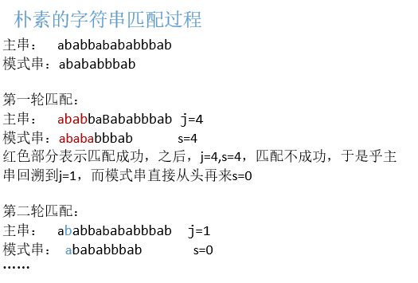
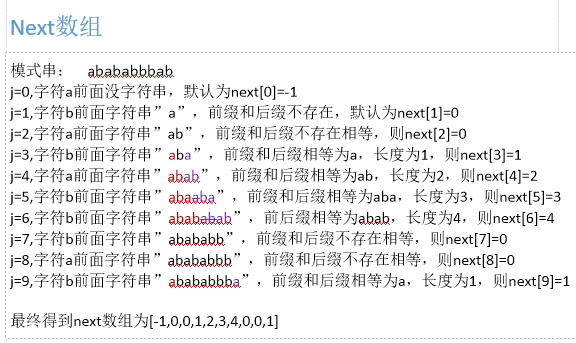
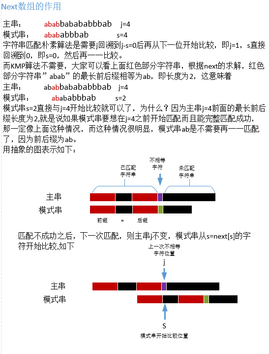

## 【算法】KMP经典算法，你真的懂了吗？

转自https://blog.csdn.net/gesanghuazgy/article/details/52214718

### KMP的概念

首先说说什么是KMP算法，说白了，就是不希望用简单的两层循环遍历两个串那样去看能否匹配成功。简单朴素的字符串匹配是，一旦匹配不成功，主串要回到匹配开始的起始位置，然后加1再和模式串从头匹配。 



如此效率太低，有没有效率更高的呢，显然是有的，这就是KMP，KMP算法效率之所以高，是因为主串不用回溯，只要模式串回溯就可以，也就是上面的j=4,s=4发现不匹配之后，j=4不变，s改变，那s到底怎么改变呢，这就是next数组的作用了！

### next数组的概念

看过KMP的人都知道字符串前缀和后缀这两个概念，而我并不会说这两个概念。next数组通俗易懂的理解就是，对于模式串中每一个字符，看它<u>前面字符串中存在的前缀和后缀匹配的最长长度</u>。什么意思呢？ 



所谓的next数组就是求前面串中前后缀相等的最大长度而已。

### next数组的作用

尽管知道了next数组，但是它做什么作用呢？知道求这个数组，但是仍然不能知道它有什么意义，那也白搭不是？接下来，便是KMP中的精髓，即next数组有什么作用。请看下图： 



从上面过程可以知道，next数组就是保存着当主串和模式串不匹配时，接下来与主串j比较的模式串中s的位置，即s=next[s]。

### next数组的求法

前面有对next求解的过程，然而那只是为了理解next的含义，真正算法编程却无法那样直观求出，那该如何求解next数组呢？这里用到了类似并查集的算法。 
主串：abababbbab

- 首先next[0]=-1,next[1]=0；
- 之后每一位j的next求解: 
  比较j-1字符与next[j-1]是否相等， 
  如果相等则next[j]=next[j-1]+1, 
  如果不相等，则比较j-1字符与next[next[j-1]]是否相等， 
     1) 如果相等则next[next[j-1]]+1, 
     2)如果不相等则继续以此下去，直到next[…]=-1,则next[j]=0.

通俗易懂的话来说就是你要求解当前位的next值，则看前一位与前一位next所在位字符是否相等，相等则当前位的next等于前一位next+1，如果不等就找前一位next的next与前一位比较，如果相等，当前位的next等于那个与前一位字符相等的字符所在位置+1，如果还是不相等，则以此类推，直到出现比较位为next[]=-1，那当前位的next就等于-1。


然而在算法求解的时候，我们应该这样去理解，求解下一位的next等于当前位与当前位的next比较。算法如下:

```java
//next的求解
private static void getNext(int[] next, String str) {
        next[0]=-1;//初始化
        int k=-1;//记录当前位的next
        int j=0;//当前位下标
        while(j<str.length()-1){//求解完所有字符的next
            if(k==-1||str.charAt(j)==str.charAt(k)){//比较当前位与当前位next字符是否相等
                j++;
                k++;//当前位的next值+1作为下一位的next值
                next[j]=k;//求解出下一位的next值
            }else{
                k=next[k];//如果不相等则找当前位的next的next与当前位比较
            }
        }
    }
```

### 完整的KMP算法

在搞懂上面所有东西之后，那字符串匹配算法KMP就呼之欲出了。简言之，将主串与模式串匹配，相等的话彼此都+1，如果不等，主串j不回溯，将模式串的s=next[s]与主串j比较，相等彼此+1，以此类推，直到模式串完全被匹配，或者主串匹配到最末，结束。算法如下：

```java
import java.util.ArrayList;
import java.util.List;
import java.util.Scanner;

public class KMP{
    public static void main(String[] args) {
        Scanner sc = new Scanner(System.in);
        String str1 = sc.nextLine();//主串
        while(sc.hasNext()){
            String str2 = sc.nextLine();//模式串
            int next[] = new int[str2.length()];
                getNext(next,str2);//求解next数组
                System.out.println("next数组"+java.util.Arrays.toString(next));
            List<Integer> pos = new ArrayList<>();
          		//可能存在多个位置起始的字符串与模式串匹配，记录这些在主串中的位置
            ifMatch(str1,str2,next,pos);//字符串匹配过程
            System.out.println("匹配位置："+pos);//输出所有匹配的位置
        }

    }

    private static void ifMatch(String str1, String str2, int[] next,List<Integer> pos){
        int j=0;//主串初始位置
        int s=0;//匹配串初始位置
        while(j<str1.length()){
            if(s==-1||str1.charAt(j)==str2.charAt(s)){//比较字符是否相等
                j++;
                s++;
                if(s>=str2.length()){//模式串被完全匹配
                    pos.add(j-str2.length());
                    s=0;
                    j--;
                }
            }else{
                s=next[s];//不等，主串j不变，模式串s变
            }
        }

    }
      //next数组的求解
    private static void getNext(int[] next, String str) {
        next[0]=-1;
        int k=-1;
        int j=0;
        while(j<str.length()-1){
            if(k==-1||str.charAt(j)==str.charAt(k)){
                j++;
                k++;
                next[j]=k;
            }else{
                k=next[k];
            }
        }
    }
}
```